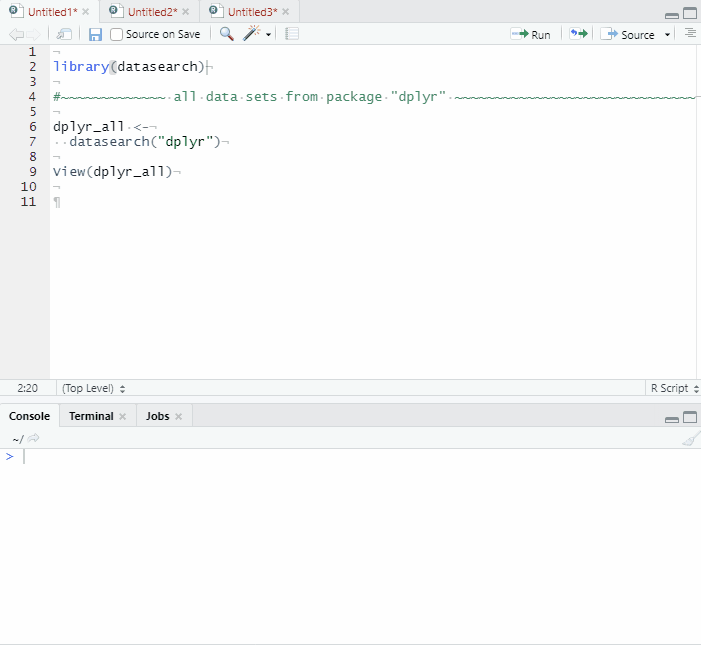
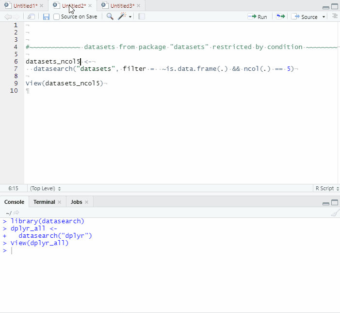
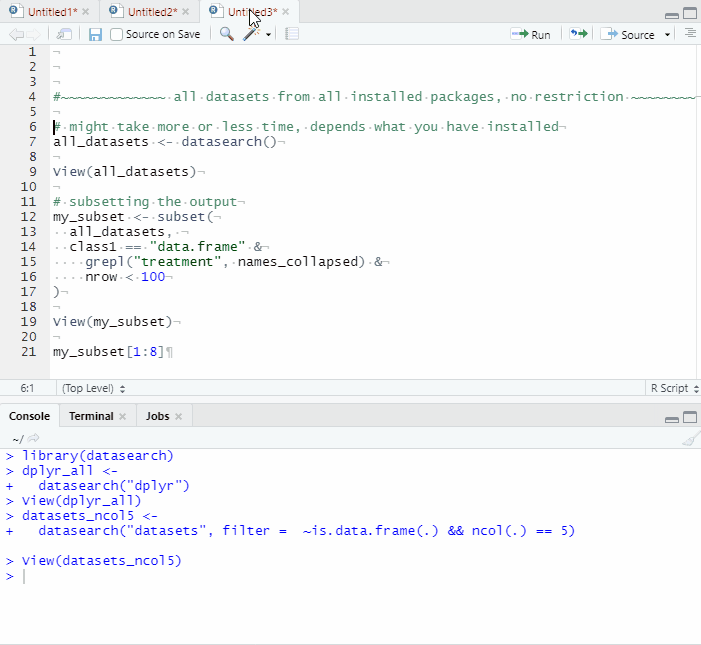

<!-- README.md is generated from README.Rmd. Please edit that file -->

```{r, include = FALSE}
knitr::opts_chunk$set(
  collapse = TRUE,
  comment = "#>",
  fig.path = "man/figures/README-",
  out.width = "100%"
)
```

# datasearch

*{datasearch}* is a one function package that can be used to find datasets 
observing specific conditions, either in a specific package, 
a list of packages, or all installed packages.

## Installation

Install with:

``` r
remotes::install_github("moodymudskipper/datasearch")
```

## Examples

```{r, eval = FALSE}
library(datasearch)

#~~~~~~~~~~~~~ all data sets from package "dplyr" ~~~~~~~~~~~~~~~~~~~~~~~~~~~~~~

dplyr_all <-
  datasearch("dplyr")

View(dplyr_all)
```



```{r, eval = FALSE}
#~~~~~~~~~~~~~ datasets from package "datasets" restricted by condition ~~~~~~~~

datasets_ncol5 <-
  datasearch("datasets", filter =  ~is.data.frame(.) && ncol(.) == 5)

View(datasets_ncol5)
```



```{r, eval = FALSE}
#~~~~~~~~~~~~~ all datasets from all installed packages, no restriction ~~~~~~~~

# might take more or less time, depends what you have installed
all_datasets <- datasearch()

View(all_datasets)

# subsetting the output
my_subset <- subset(
  all_datasets, 
  class1 == "data.frame" &
    grepl("treatment", names_collapsed) &
    nrow < 100
)

View(my_subset)
```


